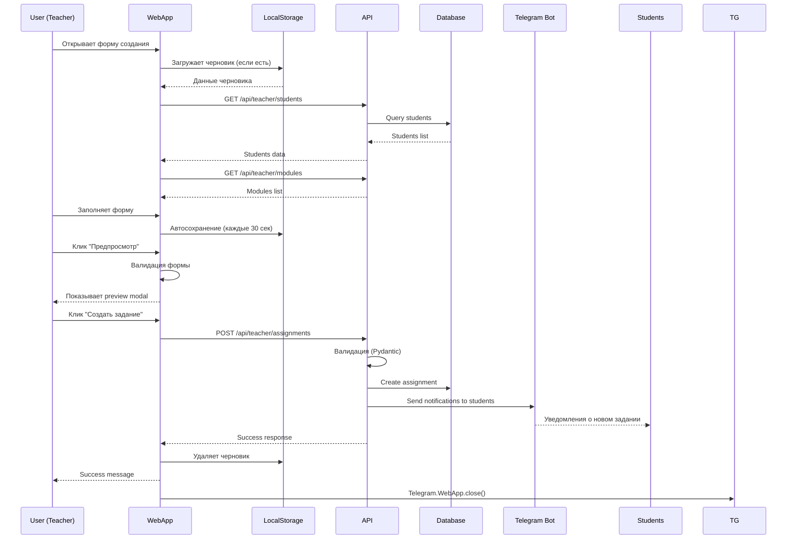

# 🏗️ Архитектура WebApp для режима учителя

## 📋 Содержание
1. [Обзор](#обзор)
2. [Структура файлов](#структура-файлов)
3. [API Endpoints](#api-endpoints)
4. [Компоненты UI](#компоненты-ui)
5. [Безопасность](#безопасность)
6. [Поток данных](#поток-данных)

---

## 🎯 Обзор

### Цель
Создать интуитивный WebApp интерфейс для учителей, который заменит многошаговый процесс создания заданий в Telegram на удобную форму.

### Ключевые преимущества
- ✅ Одностраничная форма вместо 7-15 кликов
- ✅ Сохранение черновиков в LocalStorage
- ✅ Поиск и фильтрация (ученики, вопросы)
- ✅ Предпросмотр задания перед созданием
- ✅ Нет потери контекста при закрытии
- ✅ Профессиональный UX

### MVP Scope
**Фаза 1 (текущая):**
- Форма создания заданий
- Браузер вопросов с пагинацией
- Выбор учеников с поиском
- Базовая валидация

**Будущие фазы:**
- Аналитика с графиками
- Редактирование существующих заданий
- Шаблоны заданий
- Групповые операции

---

## 📁 Структура файлов

```
/WebApp/
├── teacher/                          # Новая директория для учителя
│   ├── index.html                    # Главная страница WebApp учителя
│   ├── create-assignment.html        # Страница создания задания
│   ├── styles/
│   │   ├── main.css                  # Общие стили
│   │   ├── form.css                  # Стили форм
│   │   └── components.css            # Стили компонентов
│   ├── js/
│   │   ├── main.js                   # Точка входа
│   │   ├── api.js                    # API клиент
│   │   ├── auth.js                   # Аутентификация Telegram
│   │   ├── components/
│   │   │   ├── AssignmentForm.js     # Форма создания задания
│   │   │   ├── QuestionBrowser.js    # Браузер вопросов
│   │   │   ├── StudentSelector.js    # Выбор учеников
│   │   │   ├── ModuleSelector.js     # Выбор модулей
│   │   │   └── PreviewModal.js       # Предпросмотр задания
│   │   └── utils/
│   │       ├── storage.js            # LocalStorage helpers
│   │       ├── validation.js         # Валидация форм
│   │       └── formatters.js         # Форматирование данных
│   └── rollup.config.js              # Bundler конфиг
│
├── api/                              # Backend API (Python)
│   ├── __init__.py
│   ├── app.py                        # FastAPI приложение
│   ├── routes/
│   │   ├── __init__.py
│   │   ├── assignments.py            # Роуты для заданий
│   │   ├── questions.py              # Роуты для вопросов
│   │   └── students.py               # Роуты для учеников
│   ├── middleware/
│   │   ├── __init__.py
│   │   └── telegram_auth.py          # Валидация initData
│   └── schemas/
│       ├── __init__.py
│       ├── assignment.py             # Pydantic модели
│       └── question.py
│
├── index.html                        # Существующий WebApp (студенты)
├── navigation.js
├── script.js
├── style.css
└── ...
```

---

## 🔌 API Endpoints

### Базовый URL
```
/api/teacher/
```

### Аутентификация
Все запросы должны включать header:
```http
X-Telegram-Init-Data: <initData от Telegram.WebApp>
```

### Endpoints

#### 1️⃣ Получение данных учителя
```http
GET /api/teacher/profile
```

**Response:**
```json
{
  "teacher_id": 123,
  "name": "Иван Иванович",
  "subscription": {
    "tier": "premium",
    "expires_at": "2025-12-31T23:59:59Z"
  },
  "stats": {
    "total_students": 45,
    "total_assignments": 120,
    "active_assignments": 15
  }
}
```

---

#### 2️⃣ Список учеников
```http
GET /api/teacher/students?search=<query>&limit=50&offset=0
```

**Query Parameters:**
- `search` (опционально) - поиск по имени
- `limit` - количество записей (default: 50)
- `offset` - смещение для пагинации

**Response:**
```json
{
  "total": 45,
  "students": [
    {
      "id": 1,
      "user_id": 987654321,
      "name": "Мария Петрова",
      "username": "@maria_p",
      "connected_at": "2024-09-01T10:00:00Z",
      "stats": {
        "completed_assignments": 12,
        "average_score": 85.5
      }
    }
  ]
}
```

---

#### 3️⃣ Список модулей и тем
```http
GET /api/teacher/modules
```

**Response:**
```json
{
  "modules": [
    {
      "code": "test_part",
      "name": "📝 Тестовая часть (1-16)",
      "total_questions": 450,
      "description": "Вопросы из тестовой части ЕГЭ"
    },
    {
      "code": "task19",
      "name": "💡 Задание 19",
      "total_questions": 120,
      "description": "Анализ ситуации"
    }
  ]
}
```

---

#### 4️⃣ Браузер вопросов
```http
GET /api/teacher/questions?module=<module_code>&search=<query>&limit=20&offset=0
```

**Query Parameters:**
- `module` (обязательно) - код модуля
- `search` (опционально) - поиск по тексту вопроса
- `limit` - количество записей
- `offset` - смещение

**Response:**
```json
{
  "total": 450,
  "questions": [
    {
      "id": "test_part_123",
      "module": "test_part",
      "number": 5,
      "text": "Выберите верные суждения о...",
      "type": "multiple_choice",
      "difficulty": "medium",
      "topic": "Социальная стратификация"
    }
  ]
}
```

---

#### 5️⃣ Создание задания
```http
POST /api/teacher/assignments
```

**Request Body:**
```json
{
  "assignment_type": "mixed",
  "title": "Домашнее задание №5",
  "description": "Подготовка к контрольной",
  "deadline": "2025-01-15T23:59:59Z",
  "student_ids": [1, 2, 3],
  "modules": [
    {
      "module_code": "test_part",
      "selection_mode": "random",
      "question_count": 10
    },
    {
      "module_code": "task19",
      "selection_mode": "specific",
      "question_ids": ["task19_45", "task19_67"]
    }
  ]
}
```

**Response:**
```json
{
  "success": true,
  "assignment_id": 456,
  "created_at": "2025-12-29T15:30:00Z",
  "message": "Задание успешно создано и отправлено 3 ученикам",
  "students_notified": 3
}
```

**Errors:**
```json
{
  "success": false,
  "error": "validation_error",
  "details": {
    "title": "Название должно быть от 3 до 100 символов"
  }
}
```

---

#### 6️⃣ Сохранение черновика
```http
POST /api/teacher/drafts
```

**Request Body:**
```json
{
  "draft_data": {
    "assignment_type": "mixed",
    "title": "Незаконченное задание...",
    "modules": []
  }
}
```

**Response:**
```json
{
  "draft_id": "draft_789",
  "saved_at": "2025-12-29T15:35:00Z"
}
```

---

#### 7️⃣ Получение черновиков
```http
GET /api/teacher/drafts
```

**Response:**
```json
{
  "drafts": [
    {
      "draft_id": "draft_789",
      "created_at": "2025-12-29T15:35:00Z",
      "data": {
        "assignment_type": "mixed",
        "title": "Незаконченное задание..."
      }
    }
  ]
}
```

---

## 🎨 Компоненты UI

### 1. AssignmentForm (Главная форма)

**Структура:**
```html
<div class="assignment-form">
  <!-- Шаг 1: Тип задания -->
  <section class="form-section">
    <h3>1. Тип задания</h3>
    <div class="assignment-types">
      <button class="type-card" data-type="test_part">
        📝 Тестовая часть
      </button>
      <button class="type-card" data-type="mixed">
        🔀 Смешанное
      </button>
      <!-- ... -->
    </div>
  </section>

  <!-- Шаг 2: Выбор вопросов (зависит от типа) -->
  <section class="form-section" id="question-selection">
    <!-- Динамически загружается -->
  </section>

  <!-- Шаг 3: Детали задания -->
  <section class="form-section">
    <h3>3. Детали задания</h3>
    <input type="text" id="assignment-title"
           placeholder="Название задания"
           minlength="3" maxlength="100">
    <textarea id="assignment-description"
              placeholder="Описание (опционально)"></textarea>
  </section>

  <!-- Шаг 4: Ученики -->
  <section class="form-section">
    <h3>4. Выбор учеников</h3>
    <div id="student-selector"></div>
  </section>

  <!-- Шаг 5: Дедлайн -->
  <section class="form-section">
    <h3>5. Дедлайн</h3>
    <input type="datetime-local" id="deadline">
    <label>
      <input type="checkbox" id="no-deadline">
      Без дедлайна
    </label>
  </section>

  <!-- Действия -->
  <div class="form-actions">
    <button class="btn-secondary" id="save-draft">
      💾 Сохранить черновик
    </button>
    <button class="btn-primary" id="preview">
      👁️ Предпросмотр
    </button>
    <button class="btn-primary" id="create" disabled>
      ✅ Создать задание
    </button>
  </div>
</div>
```

**JavaScript API:**
```javascript
class AssignmentForm {
  constructor(container) {
    this.container = container;
    this.state = {
      assignmentType: null,
      modules: [],
      title: '',
      description: '',
      studentIds: [],
      deadline: null
    };
  }

  async init() {
    await this.loadDraft(); // Из LocalStorage
    this.render();
    this.attachEventListeners();
    this.startAutoSave();
  }

  validate() {
    const errors = {};
    if (!this.state.title || this.state.title.length < 3) {
      errors.title = 'Название должно быть от 3 до 100 символов';
    }
    if (this.state.studentIds.length === 0) {
      errors.students = 'Выберите хотя бы одного ученика';
    }
    return errors;
  }

  async submit() {
    const errors = this.validate();
    if (Object.keys(errors).length > 0) {
      this.showErrors(errors);
      return;
    }

    const response = await API.createAssignment(this.state);
    if (response.success) {
      this.clearDraft();
      Telegram.WebApp.showAlert('Задание создано!');
      Telegram.WebApp.close();
    }
  }
}
```

---

### 2. QuestionBrowser (Браузер вопросов)

**Функции:**
- Пагинация (по 20 вопросов)
- Поиск по тексту
- Фильтры (сложность, тема)
- Множественный выбор
- Счетчик выбранных вопросов

**UI:**
```html
<div class="question-browser">
  <!-- Поиск и фильтры -->
  <div class="browser-controls">
    <input type="search" placeholder="🔍 Поиск по тексту..."
           id="question-search">
    <select id="difficulty-filter">
      <option value="">Все сложности</option>
      <option value="easy">Легкие</option>
      <option value="medium">Средние</option>
      <option value="hard">Сложные</option>
    </select>
  </div>

  <!-- Список вопросов -->
  <div class="question-list" id="question-list">
    <!-- Динамически загружается -->
  </div>

  <!-- Пагинация -->
  <div class="pagination">
    <button id="prev-page" disabled>← Назад</button>
    <span>Страница <span id="current-page">1</span> из <span id="total-pages">23</span></span>
    <button id="next-page">Вперед →</button>
  </div>

  <!-- Информация -->
  <div class="browser-info">
    Выбрано вопросов: <strong id="selected-count">0</strong>
  </div>
</div>
```

**JavaScript:**
```javascript
class QuestionBrowser {
  constructor(moduleCode) {
    this.moduleCode = moduleCode;
    this.currentPage = 1;
    this.pageSize = 20;
    this.selectedIds = new Set();
    this.searchQuery = '';
  }

  async loadQuestions() {
    const response = await API.getQuestions({
      module: this.moduleCode,
      search: this.searchQuery,
      limit: this.pageSize,
      offset: (this.currentPage - 1) * this.pageSize
    });

    this.totalPages = Math.ceil(response.total / this.pageSize);
    this.render(response.questions);
  }

  render(questions) {
    const html = questions.map(q => `
      <div class="question-card ${this.selectedIds.has(q.id) ? 'selected' : ''}">
        <input type="checkbox"
               data-id="${q.id}"
               ${this.selectedIds.has(q.id) ? 'checked' : ''}>
        <div class="question-content">
          <span class="question-number">#${q.number}</span>
          <p class="question-text">${q.text}</p>
          <span class="question-topic">${q.topic}</span>
        </div>
      </div>
    `).join('');

    document.getElementById('question-list').innerHTML = html;
  }

  toggleSelection(questionId) {
    if (this.selectedIds.has(questionId)) {
      this.selectedIds.delete(questionId);
    } else {
      this.selectedIds.add(questionId);
    }
    this.updateCounter();
  }
}
```

---

### 3. StudentSelector (Выбор учеников)

**Функции:**
- Поиск по имени/username
- Множественный выбор
- Быстрые фильтры (все, никого, последние)
- Отображение статистики ученика

**UI:**
```html
<div class="student-selector">
  <!-- Поиск -->
  <input type="search" placeholder="🔍 Поиск учеников..."
         id="student-search">

  <!-- Быстрые действия -->
  <div class="quick-actions">
    <button id="select-all">Выбрать всех</button>
    <button id="select-none">Снять выбор</button>
  </div>

  <!-- Список учеников -->
  <div class="student-list" id="student-list">
    <!-- Динамически загружается -->
  </div>

  <!-- Счетчик -->
  <div class="selector-info">
    Выбрано учеников: <strong id="selected-students-count">0</strong>
  </div>
</div>
```

---

### 4. PreviewModal (Предпросмотр)

**Функция:**
Показывает, как будет выглядеть задание для учеников перед отправкой.

**UI:**
```html
<div class="preview-modal" id="preview-modal">
  <div class="modal-content">
    <div class="modal-header">
      <h2>Предпросмотр задания</h2>
      <button class="close-btn">×</button>
    </div>

    <div class="modal-body">
      <h3 id="preview-title"></h3>
      <p id="preview-description"></p>

      <div class="preview-info">
        <div class="info-item">
          <span class="label">Тип:</span>
          <span id="preview-type"></span>
        </div>
        <div class="info-item">
          <span class="label">Вопросов:</span>
          <span id="preview-questions-count"></span>
        </div>
        <div class="info-item">
          <span class="label">Учеников:</span>
          <span id="preview-students-count"></span>
        </div>
        <div class="info-item">
          <span class="label">Дедлайн:</span>
          <span id="preview-deadline"></span>
        </div>
      </div>

      <div class="preview-questions">
        <h4>Вопросы:</h4>
        <ul id="preview-questions-list"></ul>
      </div>
    </div>

    <div class="modal-footer">
      <button class="btn-secondary" id="preview-cancel">Вернуться к редактированию</button>
      <button class="btn-primary" id="preview-confirm">✅ Создать задание</button>
    </div>
  </div>
</div>
```

---

## 🔒 Безопасность

### 1. Аутентификация Telegram

**Frontend (auth.js):**
```javascript
class TelegramAuth {
  static getInitData() {
    if (!window.Telegram?.WebApp) {
      throw new Error('Telegram WebApp не доступен');
    }
    return window.Telegram.WebApp.initData;
  }

  static getUserInfo() {
    return window.Telegram.WebApp.initDataUnsafe.user;
  }

  static isTeacher() {
    // Проверка на сервере
    return true;
  }
}
```

**Backend (telegram_auth.py):**
```python
from fastapi import Header, HTTPException
from hashlib import sha256
import hmac
from urllib.parse import parse_qsl

def verify_telegram_webapp(init_data: str = Header(alias="X-Telegram-Init-Data")):
    """
    Проверяет подпись Telegram WebApp initData.

    Документация: https://core.telegram.org/bots/webapps#validating-data-received-via-the-mini-app
    """
    if not init_data:
        raise HTTPException(status_code=401, detail="Missing init data")

    # Парсим initData
    data_dict = dict(parse_qsl(init_data))

    # Извлекаем hash
    received_hash = data_dict.pop('hash', None)
    if not received_hash:
        raise HTTPException(status_code=401, detail="Missing hash")

    # Создаем строку для проверки
    data_check_string = '\n'.join(
        f'{k}={v}' for k, v in sorted(data_dict.items())
    )

    # Вычисляем ожидаемый hash
    secret_key = hmac.new(
        b"WebAppData",
        BOT_TOKEN.encode(),
        sha256
    ).digest()

    expected_hash = hmac.new(
        secret_key,
        data_check_string.encode(),
        sha256
    ).hexdigest()

    # Сравниваем
    if not hmac.compare_digest(received_hash, expected_hash):
        raise HTTPException(status_code=401, detail="Invalid hash")

    # Извлекаем user_id
    user_data = json.loads(data_dict.get('user', '{}'))
    user_id = user_data.get('id')

    if not user_id:
        raise HTTPException(status_code=401, detail="Missing user ID")

    # Проверяем, что это учитель
    teacher = TeacherProfile.query.filter_by(user_id=user_id).first()
    if not teacher:
        raise HTTPException(status_code=403, detail="Not a teacher")

    return teacher
```

### 2. Валидация данных

**Pydantic схемы (schemas/assignment.py):**
```python
from pydantic import BaseModel, Field, validator
from typing import List, Optional
from datetime import datetime

class ModuleSelection(BaseModel):
    module_code: str = Field(..., regex=r'^(test_part|task19|task20|task24|task25)$')
    selection_mode: str = Field(..., regex=r'^(all|random|specific|by_topics)$')
    question_count: Optional[int] = Field(None, ge=1, le=100)
    question_ids: Optional[List[str]] = None

    @validator('question_ids')
    def validate_question_ids(cls, v, values):
        if values.get('selection_mode') == 'specific' and not v:
            raise ValueError('question_ids required for specific selection mode')
        return v

class CreateAssignmentRequest(BaseModel):
    assignment_type: str = Field(..., regex=r'^(test_part|task19|task20|task24|task25|full_exam|mixed|custom)$')
    title: str = Field(..., min_length=3, max_length=100)
    description: Optional[str] = Field(None, max_length=500)
    deadline: Optional[datetime] = None
    student_ids: List[int] = Field(..., min_items=1, max_items=100)
    modules: List[ModuleSelection] = Field(..., min_items=1, max_items=5)

    @validator('deadline')
    def validate_deadline(cls, v):
        if v and v < datetime.utcnow():
            raise ValueError('Deadline cannot be in the past')
        return v
```

### 3. Rate Limiting

```python
from fastapi_limiter import FastAPILimiter
from fastapi_limiter.depends import RateLimiter

@app.post(
    "/api/teacher/assignments",
    dependencies=[Depends(RateLimiter(times=20, hours=1))]
)
async def create_assignment(...):
    # Максимум 20 заданий в час
    pass
```

---

## 🔄 Поток данных

### Создание задания (полный цикл)



### Автосохранение черновика

```javascript
class AssignmentForm {
  startAutoSave() {
    this.autoSaveInterval = setInterval(() => {
      this.saveDraft();
    }, 30000); // Каждые 30 секунд
  }

  saveDraft() {
    const draft = {
      timestamp: Date.now(),
      data: this.state
    };
    localStorage.setItem('assignment_draft', JSON.stringify(draft));
  }

  loadDraft() {
    const draft = localStorage.getItem('assignment_draft');
    if (!draft) return null;

    const parsed = JSON.parse(draft);

    // Проверяем, не слишком ли старый черновик (24 часа)
    const age = Date.now() - parsed.timestamp;
    if (age > 24 * 60 * 60 * 1000) {
      localStorage.removeItem('assignment_draft');
      return null;
    }

    return parsed.data;
  }
}
```

---

## 🎨 Дизайн система

### Цветовая палитра (Telegram Variables)

```css
:root {
  /* Используем переменные Telegram */
  --tg-theme-bg-color: var(--tg-theme-bg-color, #ffffff);
  --tg-theme-text-color: var(--tg-theme-text-color, #000000);
  --tg-theme-hint-color: var(--tg-theme-hint-color, #999999);
  --tg-theme-link-color: var(--tg-theme-link-color, #2481cc);
  --tg-theme-button-color: var(--tg-theme-button-color, #2481cc);
  --tg-theme-button-text-color: var(--tg-theme-button-text-color, #ffffff);
  --tg-theme-secondary-bg-color: var(--tg-theme-secondary-bg-color, #f1f1f1);

  /* Кастомные цвета для статусов */
  --color-success: #4caf50;
  --color-error: #f44336;
  --color-warning: #ff9800;
  --color-info: #2196f3;
}
```

### Компоненты

```css
/* Кнопки */
.btn-primary {
  background: var(--tg-theme-button-color);
  color: var(--tg-theme-button-text-color);
  border: none;
  padding: 12px 24px;
  border-radius: 8px;
  font-size: 16px;
  cursor: pointer;
  transition: opacity 0.2s;
}

.btn-primary:hover {
  opacity: 0.9;
}

.btn-primary:disabled {
  opacity: 0.5;
  cursor: not-allowed;
}

/* Карточки */
.card {
  background: var(--tg-theme-secondary-bg-color);
  border-radius: 12px;
  padding: 16px;
  margin-bottom: 12px;
}

/* Формы */
input[type="text"],
input[type="search"],
textarea {
  background: var(--tg-theme-bg-color);
  color: var(--tg-theme-text-color);
  border: 1px solid var(--tg-theme-hint-color);
  border-radius: 8px;
  padding: 12px;
  font-size: 16px;
  width: 100%;
}

input:focus,
textarea:focus {
  outline: none;
  border-color: var(--tg-theme-button-color);
}

/* Чекбоксы */
.checkbox-label {
  display: flex;
  align-items: center;
  gap: 8px;
  cursor: pointer;
}
```

---

## 📱 Responsive Design

```css
/* Mobile First подход */
.assignment-form {
  padding: 16px;
}

.form-section {
  margin-bottom: 24px;
}

/* Tablet (768px+) */
@media (min-width: 768px) {
  .assignment-form {
    max-width: 600px;
    margin: 0 auto;
  }
}

/* Desktop (1024px+) */
@media (min-width: 1024px) {
  .assignment-form {
    max-width: 800px;
  }

  .question-list {
    display: grid;
    grid-template-columns: repeat(2, 1fr);
    gap: 12px;
  }
}
```

---

## ⚡ Производительность

### Оптимизации

1. **Lazy Loading:** Вопросы загружаются только при открытии браузера
2. **Debouncing:** Поиск запускается через 300ms после последнего ввода
3. **Pagination:** По 20 элементов на странице
4. **LocalStorage:** Черновики хранятся локально
5. **Минификация:** Rollup минифицирует bundle

```javascript
// Debounce для поиска
function debounce(func, wait) {
  let timeout;
  return function(...args) {
    clearTimeout(timeout);
    timeout = setTimeout(() => func.apply(this, args), wait);
  };
}

const searchHandler = debounce(async (query) => {
  await browser.loadQuestions(query);
}, 300);
```

---

## 🧪 Тестирование

### План тестирования

1. **Unit тесты:**
   - Валидация форм
   - Утилиты (formatters, storage)
   - API клиент

2. **Integration тесты:**
   - Создание задания end-to-end
   - Автосохранение черновиков
   - Аутентификация

3. **Manual тестирование:**
   - iOS Safari
   - Android Chrome
   - Desktop Telegram

### Пример теста

```javascript
// tests/validation.test.js
import { validateAssignmentForm } from '../utils/validation.js';

describe('Assignment Form Validation', () => {
  test('validates title length', () => {
    const state = {
      title: 'AB', // Слишком короткое
      studentIds: [1],
      modules: [{ module_code: 'task19' }]
    };

    const errors = validateAssignmentForm(state);
    expect(errors.title).toBe('Название должно быть от 3 до 100 символов');
  });

  test('requires at least one student', () => {
    const state = {
      title: 'Valid Title',
      studentIds: [],
      modules: [{ module_code: 'task19' }]
    };

    const errors = validateAssignmentForm(state);
    expect(errors.students).toBe('Выберите хотя бы одного ученика');
  });
});
```

---

## 🚀 Deployment

### Build процесс

```bash
# Frontend
cd WebApp/teacher
npm install
npm run build  # Создает bundle.js

# Backend
cd api
pip install -r requirements.txt
uvicorn app:app --reload
```

### Environment Variables

```bash
# .env
BOT_TOKEN=your_bot_token
DATABASE_URL=sqlite:///ege_bot.db
WEBAPP_URL=https://yourdomain.com/WebApp/teacher
ALLOWED_ORIGINS=https://t.me,https://web.telegram.org
```

---

## 📈 Метрики успеха

После запуска WebApp будем отслеживать:

1. **Adoption Rate:** % учителей, использующих WebApp vs старый интерфейс
2. **Time to Create:** Среднее время создания задания
3. **Completion Rate:** % начатых форм, которые были завершены
4. **Error Rate:** Частота валидационных ошибок
5. **User Satisfaction:** Feedback от учителей

---

## 🔮 Будущие улучшения

### Фаза 2: Аналитика
- Графики успеваемости (Chart.js)
- Экспорт в CSV/Excel
- Сравнение учеников
- Тепловая карта по темам

### Фаза 3: Шаблоны
- Сохранение заданий как шаблоны
- Библиотека готовых заданий
- Клонирование заданий

### Фаза 4: Collaboration
- Групповые задания
- Обмен заданиями между учителями
- Публичная библиотека

---

## 📚 Ресурсы

- [Telegram WebApp API](https://core.telegram.org/bots/webapps)
- [FastAPI Documentation](https://fastapi.tiangolo.com/)
- [Pydantic Documentation](https://docs.pydantic.dev/)
- [Rollup Documentation](https://rollupjs.org/)

---

**Дата создания:** 2025-12-29
**Версия:** 1.0
**Автор:** Claude Code
